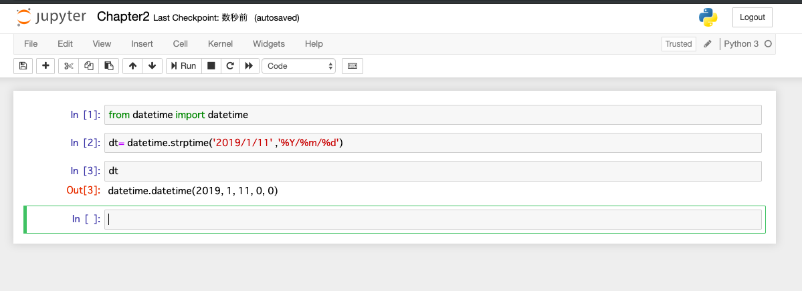

## 機械学習環境構築

1. 仮想環境構築

python3 -m venv env

2. 仮想環境実行

source env/bin/activate

3. pipを最新化

python -m pip install --upgrade pip

4. Jupiterをダウンロード

pip install jupyter

5. Jupiter Notebookを起動

jupyter notebook

6. Jupiterで簡単なプログラミング実行。（コード入力後、Tab＋Enterで実行可能。）

